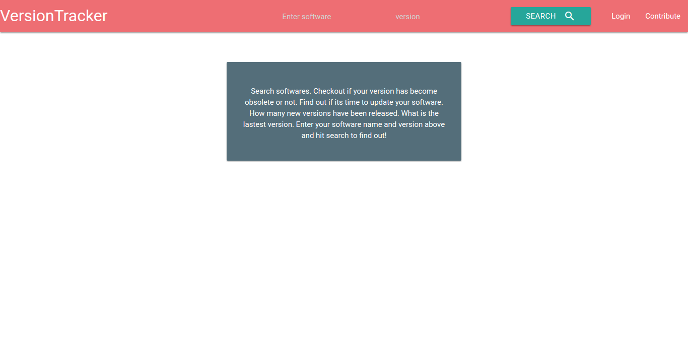
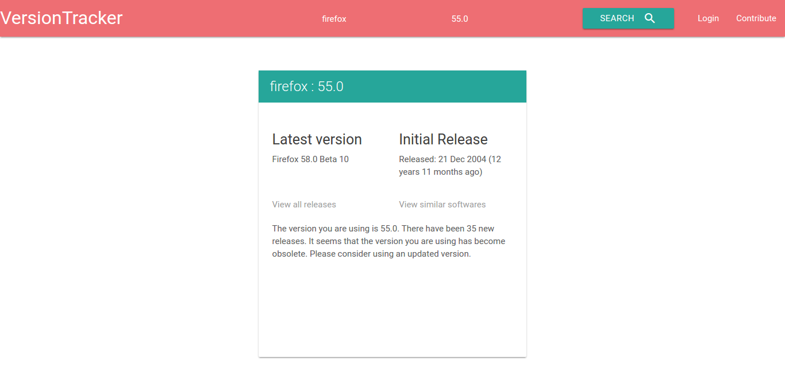
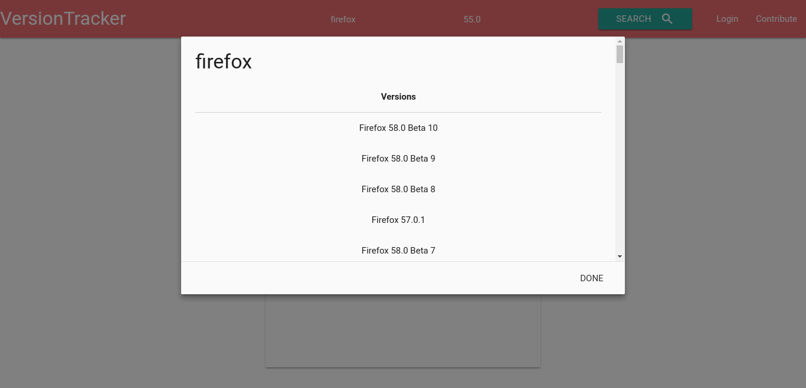
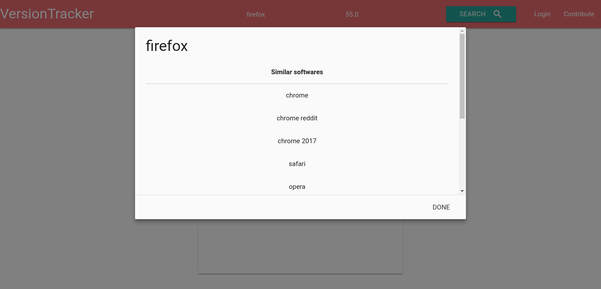

# VersionTracker

VersionTracker is a webapp where you can search softwares and know whether the version you are using is outdated or not. The 
app will list the various versions of the software that has been released and the number of versions which has been relaased
after the version you are using. The app also suggests you alternative softwares which you may consider using.

## Stack used
- Flask : Webframework in Python
- Postgres : Database
- BeautifulSoup : Webscraping
- Jinja : Templating language
- flask-admin : For craeting admin
- flask-login : For creating auth system
- SQLAlchemy : ORM
- MaterialiseCSS : For UI
- gunicorn : Web Server
- Heroku : Deployment

## REST API
VersionTracker provides a RESTful service. The following endpoint is provided -
**METHOD : GET**
https://version-tracker.herokuapp.com/version_track/api?name=[software_name]&version=[software_version]
For example: 
https://version-tracker.herokuapp.com/version_track/api?name=firefox&version=55

**Output**
```
{
  "initial_release": "Released: 03 May 2013 (4 years 7 months ago)\r\n", 
  "latest_version": "Skype 7.40.0.103", 
  "name": "skype", 
  "number_of_versions": 78, 
  "similar_softwares": [
    "skype for business", 
    "discord", 
    "facetime", 
    "hangouts", 
    "viber", 
    "zoom", 
    "whatsapp", 
    "google voice", 
    "webex", 
    "slack"
  ], 
  "software_found": "FOUND", 
  "version_found": "NOT_FOUND", 
  "versions": [
    "Skype 7.40.0.103", 
    "Skype 7.39.0.102", 
    "Skype 7.38.0.101", 
    "Skype 7.37.0.103", 
    "Skype 7.36.0.101", 
    "Skype 7.35.0.103", 
    "Skype 7.35.0.102", 
    "Skype 7.35.0.101", 
    "Skype 7.34.0.103", 
    "Skype 7.34.0.102", 
    "Skype 7.34.0.102", 
    "Skype 7.33.0.105", 
    "Skype 7.32.0.104", 
    "Skype 7.32.0.103", 
    "Skype 7.30.80.105", 
    "Skype 7.30.85.103", 
    "Skype 7.29.0.102", 
    "Skype 7.28.0.101", 
    "Skype 7.27.0.101", 
    "Skype 7.26.0.101", 
    "Skype 7.25.0.106", 
    "Skype 7.25.0.106", 
    "Skype 7.25.0.103", 
    "Skype 7.24.0.104", 
    "Skype 7.23.0.105", 
    "Skype 7.23.0.104", 
    "Skype 7.22.0.109", 
    "Skype 7.22.0.108", 
    "Skype 7.22.0.107", 
    "Skype 7.22.0.104", 
    "Skype 7.21.0.100", 
    "Skype 7.18.0.112", 
    "Skype 7.18.0.112", 
    "Skype 7.18.0.111", 
    "Skype 7.18.0.109", 
    "Skype 7.18.0.103", 
    "Skype 7.17.0.106", 
    "Skype 7.17.0.105", 
    "Skype 7.17.0.104", 
    "Skype 7.16.0.102", 
    "Skype 7.16.0.101", 
    "Skype 7.15.0.103", 
    "Skype 7.15.0.102", 
    "Skype 7.15.0.102", 
    "Skype 7.14.0.105", 
    "Skype 7.14.0.104", 
    "Skype 7.13.0.101", 
    "Skype 7.12.0.101", 
    "Skype 7.11.0.102", 
    "Skype 7.10.0.101", 
    "Skype 7.9.0.103", 
    "Skype 7.8.0.102", 
    "Skype 7.7.0.103", 
    "Skype 7.7.0.102", 
    "Skype 7.7.0.102", 
    "Skype 7.6.0.105", 
    "Skype 7.6.0.103", 
    "Skype 7.5.0.102", 
    "Skype 7.5.0.101", 
    "Skype 7.4.0.102", 
    "Skype 7.3.0.101", 
    "Skype 7.2.0.103", 
    "Skype 7.1.0.105", 
    "Skype 7.0.0.102", 
    "Skype 7.0.0.100", 
    "Skype 7.0.0.100", 
    "Skype 6.22.64.107", 
    "Skype 6.22.64.106", 
    "Skype 6.22.81.105", 
    "Skype 6.22.81.104", 
    "Skype 6.21.0.104", 
    "Skype 6.20.0.104", 
    "Skype 6.18.0.106", 
    "Skype 6.18.0.105", 
    "Skype 6.16.0.105", 
    "Skype 6.14.0.104", 
    "Skype 6.14.0.104", 
    "Skype 6.5.0.107 Beta"
  ]
}
```
## How to use the Web app
<table>
<tr>
<td></td>
</tr>
<tr>
<td></td>
</tr>
</table>

Enter the name of your software and version in the respective fields and press search. Wait for some time as it may take a while to generate your result. Once the result is generated, it will be displayed on screen. You will be informed whether version is obsolete or not. How many new versions have been released. What was the initial release date of the software.
What is the latest version available.

You can also view all the versions of the software relased by pressing on **View all releases**.
<table>
<tr>
<td></td>
</tr>
</table>
You can also know about softwares which can serve as an alternative to the software you have searched for by pressing on **View similar softwares**
<table>
<tr>
<td></td>
</tr>
</table>

## How the app works?
The application internally scrapes information from the web, structures the informations, stores it in its own database and then presents it to the user.
### Workflow
Let us see the workflow of the app. Let us consider you have searched skype on the app. The app will scrape information
about skype from web. It will scrape information like, **all the releases of the software, its initial relelease date, 
latest version of the app, similar softwares**. After collecting all these data it will structure them and at first store them in its own data base so that if another user searched for the same software, app will not have to scrape the web for a second time. Next the server will present the collected data in JSON format to the front end client which will display it
to the user.

#### Alternate workflow: Contributing to the app
Users can contribute to the app by adding software versions, similar softwares and other versions. The main purpose of this
feature is to **buld a community of VersionTracker users who will contribute to this app and build a rich data store of software info**

**Contributing** to this app is really simple. Press on the contribute option present on the top right corner on the main page. You will need to signup in order to contribute. **VersionTracker** presently has a very basic auth system via email and password. This will be extended in future for notification, email and admin purposes.

After you are logged in, on pressing contribute you will be presented with a simple UI to enter software information. After filling up all the information press submit and your info will be recored in our database. Now others will be able to get information about the software whose data you have contributed.

Note that the data which you have added is **subject to admin's review**. This is done mainly for validation and sanitisation purposes. These will be automated in future.

### Admin system
VersionTracker has got a basic admin system.
Since the app is is testing phase, as of now the admin is open for exhibition purpose.
Admin mailid: admin@admin.com
Password: admin123
Use the credentials for exploring the admin section. The admin section provides an interface to add software data, view the database, edit tables, etc. The admin can review the both the data which has been scraped and structured from the internet as well as the data which has been contributed by the user. He/she can edit or remove the data if he/she finds any thing wrong or invalid.

Admin URL: https://version-tracker.herokuapp.com/admin


